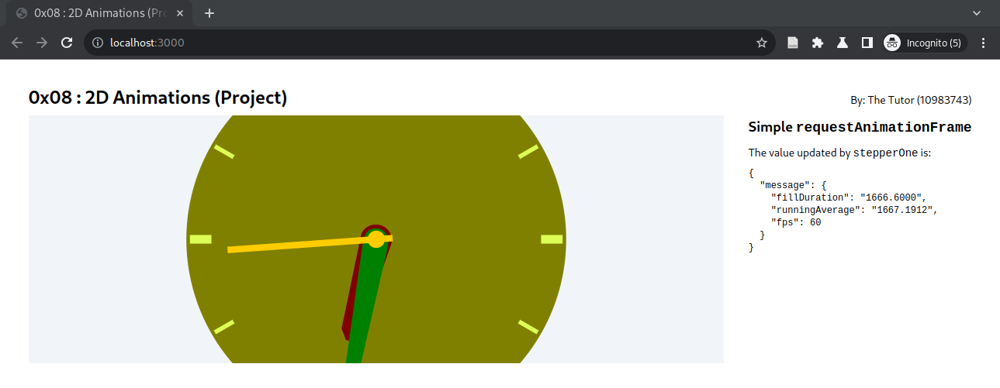

# 0x08 : 2D Animations (Project) #

### Step 1: Storyboard ###

[What is a
storyboard?](https://www.google.com/search?hl=en&q=what%20is%20storyboarding#ip=1)

It is an industry standard practice to create a rough
sketch of target outcome of an animation through a few
key-frames sketched on a piece of paper like a comic
strip; so as to [fail earlier than
later](https://hbr.org/2011/04/failing-by-design).

Create a storyboard of your target animation sequence
(or a [perpetual
motion](https://www.google.com/search?q=perpetual+motion))
as you please.  This'll be your pitch to be submitted
on the first deadline

### Step 2: Animation ###

Using the [`requestAnimationFrame`
interface](https://developer.mozilla.org/en-US/docs/Web/API/window/requestAnimationFrame) 

Create an animation of a composition of 2d geometry,
its tranforms and /or its fill/stroke styles.

As a project this gets submitted on the second
deadline.

## Submit ##

### Storyboard ###

1. Git URL
2. Commit ID
3. Storyboard (One image containing the storyboard)

### Final Project ###

1. Git URL
2. Commit ID
3. Storyboard (One image containing the storyboard)
3. Teaser
4. Video Link
